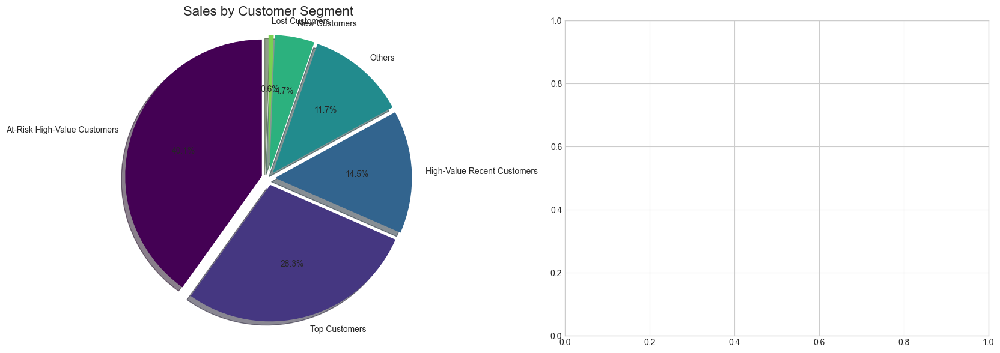
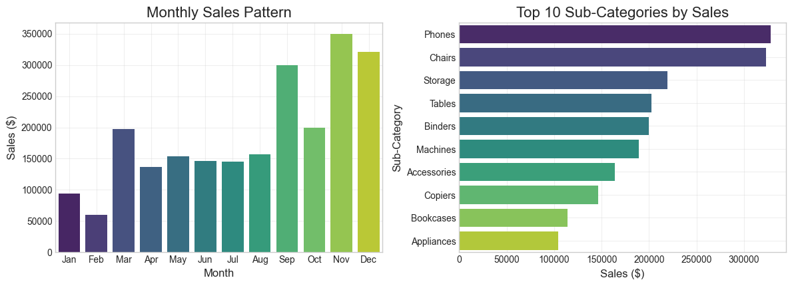

# Superstore Sales Analysis and Strategic Recommendations

## Project Overview
A comprehensive analysis of Superstore sales data spanning 4 years, aimed at identifying growth opportunities and optimizing business strategies. This project combines data analysis techniques with business strategy to extract actionable insights from retail sales data.

## Dataset Information
The dataset contains sales records from a global superstore over 4 years, including:
- Order and shipping information
- Customer details and segmentation
- Product categories and sub-categories
- Regional sales data
- Sales and profit figures

## Key Findings
- **Customer Segmentation**: At-Risk High-Value Customers (27.6% of customers) generate 40.1% of total revenue
- **Product Portfolio**: Technology category leads with 36.6% of total sales, with Phones being the best-selling sub-category
- **Regional Performance**: West region is the strongest performer (31.4% of sales), outperforming the South region by 1.8x
- **Seasonal Patterns**: November shows peak sales performance, with sales 5.9x higher than February
- **Cross-Selling Opportunities**: Strong product associations identified between Binders & Paper, Binders & Storage, and Binders & Phones

## Methodology
1. **Data Preprocessing**: Date conversion, feature engineering, and data cleaning
2. **Exploratory Data Analysis**: Time-series analysis, category distribution, and regional performance
3. **Customer Segmentation**: RFM (Recency, Frequency, Monetary) analysis to identify key customer segments
4. **Product Association Analysis**: Identifying frequently co-purchased items for cross-selling
5. **Strategic Business Analysis**: Translating data insights into actionable business strategies

## Strategic Recommendations

### 1. Customer Relationship Strategies
- Implement tiered loyalty program targeting high-value at-risk customers
- Develop segment-specific engagement plans for new, at-risk, and lost customers
- Create personalized retention offers for the 219 at-risk high-value customers

### 2. Product Portfolio Strategies
- Increase marketing investment in Technology category by 15-20%
- Develop cross-selling bundles based on product association findings
- Optimize inventory based on seasonal sales patterns

### 3. Regional Growth Strategies
- Enhance market penetration in the West region through localized marketing
- Create tailored strategies for the South region to close the performance gap
- Implement region-specific pricing based on local market dynamics

### 4. Operational Excellence Initiatives
- Optimize staffing and inventory for peak sales periods, especially November
- Implement just-in-time inventory for fast-moving items
- Review pricing strategy for low-margin products

## Implementation Roadmap
- **Phase 1 (0-90 days)**: Quick wins including retention campaigns and pricing optimization
- **Phase 2 (90-180 days)**: Strategic initiatives including segment-specific marketing
- **Phase 3 (180-365 days)**: Transformational programs including predictive analytics

## Expected Business Impact
- 8-10% increase in revenue through improved customer retention and cross-selling
- 2-3 percentage point improvement in profit margins
- 20% reduction in high-value customer churn

## Technologies Used
- **Python**: Data analysis and manipulation
- **Pandas & NumPy**: Data processing
- **Matplotlib & Seaborn**: Data visualization
- **Jupyter Notebook**: Development environment

## How to Use This Project
1. Clone this repository
2. Ensure you have the required libraries installed
3. Open the Jupyter notebook to view the full analysis
4. The dataset is included in the repository as 'train.csv'

## Future Work
- Develop a predictive model for sales forecasting
- Create an interactive dashboard for real-time monitoring
- Perform market basket analysis with more advanced algorithms

## Visual Insights

### Sales by Customer Segment

### Monthly Sales Pattern

### Top 10 Sub-Categories by Sales

